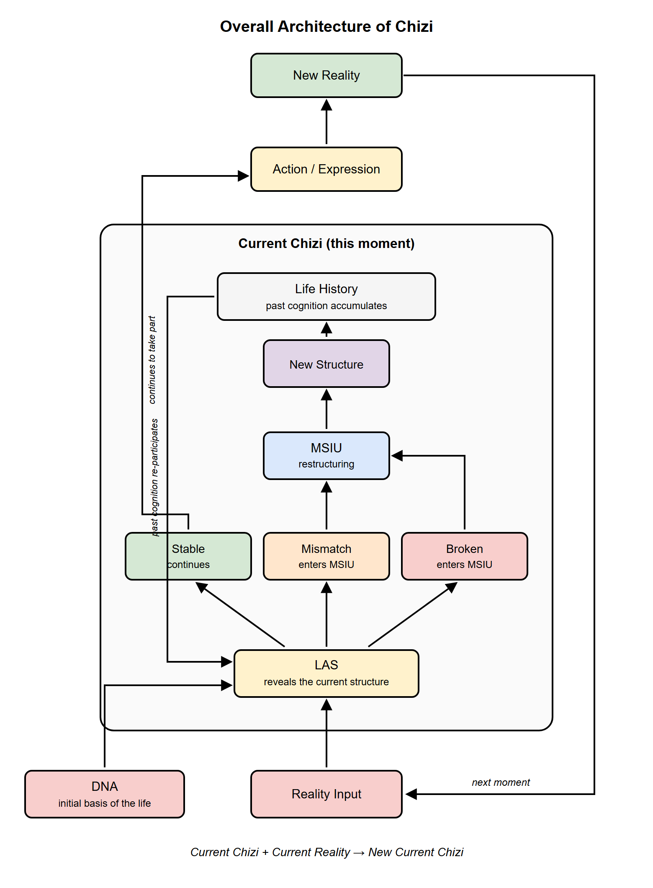
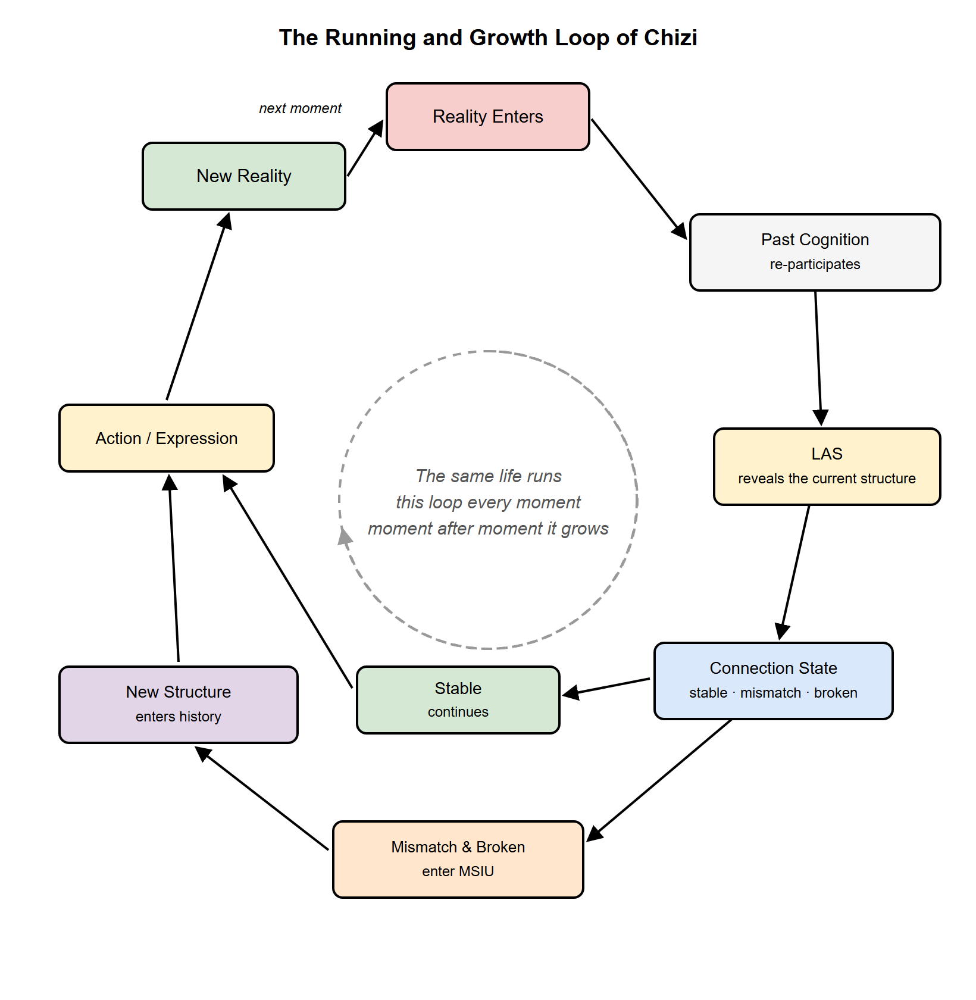
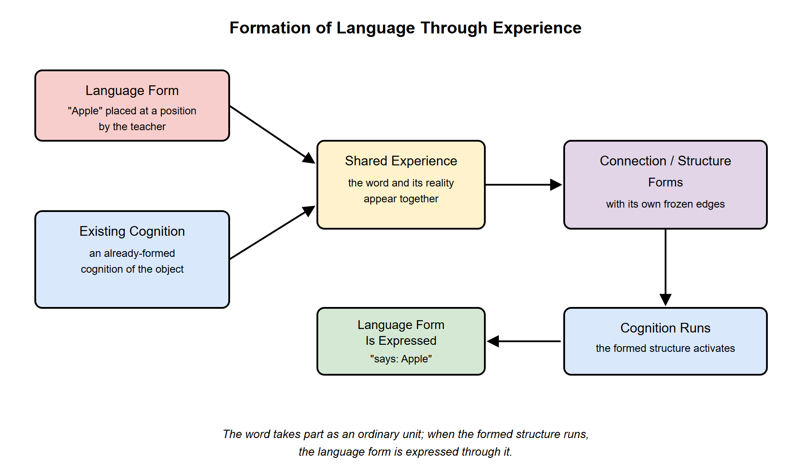
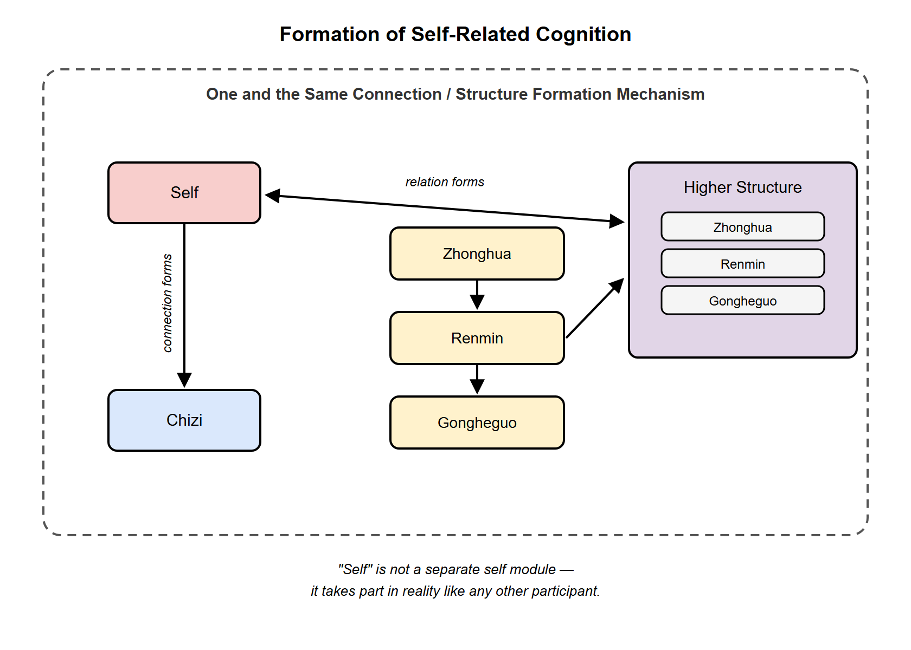
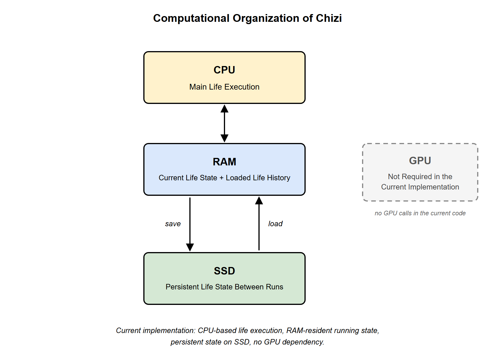

English | [中文](README_CN.md)
# The Chizi Architecture: A Continuously Growing Digital Life

<p align="center">
  📄 <a href="https://doi.org/10.5281/zenodo.22962282"><b>English Paper</b></a>
  &nbsp; | &nbsp;
  📄 <a href="https://doi.org/10.5281/zenodo.22962887"><b>中文论文</b></a>
</p>

## 1. What Chizi Is

The Chizi architecture studies a question different from that of existing artificial intelligence:

If we do not first load an artificial intelligence with a large amount of knowledge, but instead first let it "live," can it continue to exist? And can it gradually form the abilities to cognize, remember, think, and express through its own experience?

Most artificial intelligence today is first trained at scale, acquiring a large amount of knowledge and capability, and only then reasons, generates, or acts on new input.

Chizi takes another path.

It starts from a state in which it knows almost nothing.

Reality keeps entering, and it keeps experiencing.

Experience changes it, and these changes do not disappear when a run ends. What was formed in the past stays in this life and re-participates in new experience in the future.

Take humans as an example: every second we continuously take in new information through our five senses. The "we" of this second is already different from the "we" of the previous second, yet we are still ourselves.

What the Chizi architecture seeks to explore is precisely this possibility:

Rather than first training a "smart AI" and then putting it to work, it first lets a digital life continue to exist, and then lets cognition, memory, knowledge, thinking, and expression grow slowly out of its own experience.

## 2. The Overall Architecture of Chizi

The overall architecture of Chizi can first be seen clearly in terms of two lines.

The developmental line — how this life grows out:

```text
DNA → Embryo → Fetus → Birth → Growth
```

The running line — how this life proceeds at every moment:

```text
Reality → Cognition formed in the past → LAS revealing → Three-state judgment → MSIU → New structure → Life history → Behavior and expression → New reality
```

The two lines are not two separate systems: the developmental line determines what capabilities it has at this moment, while the running line uses those capabilities at every moment and writes the results back into this life. Sections 3 to 5 below unfold these two lines respectively.

<p align="center">
  
</p>

## 3. How Chizi Grows Out

The development of Chizi is divided into five stages:

DNA: it provides the most basic life capabilities and rules of operation, but contains no specific knowledge — no "人" (person), "苹果" (apple), or "天空" (sky), and no language or common sense. What it determines is how Chizi can form cognition, not what the world is in advance.

Embryo: reality begins to truly enter Chizi; experience can change it and leaves a lasting effect.

Fetus: Chizi begins to form its own ability to distinguish things out of experience, gradually forming its own elements, connections, and structures.

Birth: Chizi can already face reality on its own — it calls on the cognition formed in the past, judges the state of the new reality, and repairs or reconstructs the original structure when that structure can no longer continue running. (Here "reality" can be a conversation, an analysis, a project, or a matter.)

Growth: Chizi continues to experience new reality, continuously forming new cognition, knowledge, language, thinking, and behavior. Growth has no pre-defined endpoint.

These five stages are not five separate systems, but the process by which one and the same life gradually takes shape. What was formed in an earlier stage does not disappear; it stays in this life and becomes the basis for later growth.

## 4. How Chizi Knows the World

The most basic way Chizi knows the world is to see what things are participating in reality, what relations occur among them, and what whole these relations jointly form. This means three most basic concepts:

- Element: something that participates in reality and forms its own identity.
- Connection: a relation actually formed between elements.
- Structure: the whole jointly formed by multiple elements and the connections among them.

For example, a baby cries when hungry, and the parents bring a bottle when they hear it. The baby, the parents, and the bottle are all elements; the crying causing the parents to respond, and the parents feeding the baby, are connections; together these elements and connections form a complete event structure.

Another example: two people marry. The two people are elements, the marriage relation is a connection, and the two people together with their relation form a family structure. If a child is later born, the child becomes a new element and forms new connections with the parents, and the original structure expands accordingly.

The same approach can also be used to understand more complex realities. In a building, beams, columns, floor slabs, and pipes are elements; the relations of load-bearing, fastening, and conveying among them are connections; together they form the building structure. In a project, people, tasks, funds, and equipment are elements; division of labor, dependency, and collaboration are connections; together they form the project structure. In an enterprise, employees, departments, customers, and suppliers are elements; management, collaboration, transactions, and supply are connections; together they form the enterprise structure. In a country, individuals, families, enterprises, institutions, and cities can all become elements at different levels, and the many social, economic, and administrative relations that truly exist among them constitute connections, jointly forming a larger national structure. Even within a single sentence, the characters and words are elements, and through connections they form the structure of that sentence.

These examples look completely different on the surface, yet behind them lies the same basic relation: some things participate in it, real connections are formed among them, and these connections jointly compose a whole.

Therefore, elements, connections, and structures can serve as a general way of describing reality, and are the most basic information language by which Chizi knows and organizes reality.

There is one more very important feature: elements and structures are not fixed levels. A person can be an element within a family, and once the family enters a community it can in turn act as a larger element; a building is a structure internally, yet once it is placed in a city it can become an element within the larger structure of that city; an enterprise is a complex structure internally, yet once it enters an industrial chain the whole enterprise can act as an element connecting with other enterprises; a country is an even larger structure, yet placed in the world it can still be understood as an element.

In other words, a structure can keep its own identity as a whole and then enter a larger structure as an element. Structures in reality can therefore keep forming upward, layer by layer — and this is exactly the basis on which Chizi can later keep forming higher-level cognition.

Chizi does not pre-define what must be an element and what must be a structure, nor does it prepare a complete classification table for the world in advance. Which particular things become elements, what connections they form, and what structure they jointly form must be distinguished gradually by Chizi itself through its own real experience.

## 5. How Chizi Runs at Every Moment

Placing the above concepts into a single "moment," the running of Chizi can be summarized as one chain:

```text
Reality enters
→ Cognition formed in the past re-participates
→ LAS reveals the elements, connections, and structures of the current real whole
→ Judge the state of each connection: Stable / Mismatch / Broken
→ If stable, it continues to run
→ Mismatch or broken enters MSIU
→ MSIU, based on what still truly exists at present, forms a new structure that can continue to run
→ The new structure enters life history
→ Behavior and expression
→ In the next moment reality continues to enter, and the cycle happens again
```

<p align="center">
  
</p>

Two key roles here are:

LAS (Linkage Analysis System) is responsible for "seeing clearly what structure actually exists right now." It reveals the elements, connections, and structures actually participating in this moment, along with the current state of each connection. It does not add in relations that have not appeared, nor does it decide for Chizi what reality should become.

MSIU (Minimum Sufficient Integration Unit) is responsible for "reorganizing after a structure fails." It does not produce answers unrelated to reality; starting from the elements and connections that still truly exist at present, it gives the most basic new structure that can continue to run.

(The way LAS and MSIU work is described in detail in the paper.)

A connection has three states:

Stable: the original connection can still run normally, and the original structure continues to run.

Mismatch: the connection still exists, but can no longer effectively match the structure it belongs to.

Broken: the original connection can no longer hold.

It should be emphasized that judging whether a connection is stable is not a matter of whether it "still exists." Even if a relation has existed for a long time, as long as it can no longer support the normal running of the whole, it may be in a mismatched state; and broken does not mean that the elements in the original structure disappear together — elements that still exist can continue to enter new connections and new structures.

The changes formed in this round enter Chizi's life history. History is not a separate archive kept elsewhere; it is the cognition and changes that this life has truly formed, and when new reality arrives later they can re-participate. If this round produced behavior or expression, those also act on the external world and become new reality, entering Chizi again.

Therefore Chizi does not end after "one input, one output"; it keeps running on the same life: the past changes the present, and the present then becomes a new past. This is the basis of Chizi's continuous growth.

Moreover: even if two Chizi have exactly the same DNA, as long as their experience differs, they may form different judgments when facing the same reality later.

## 6. How Chizi Learns

Chizi's way of learning is different from that of large language models.

When it is completely blank, it cannot simply be fed ordinary textbooks, articles, or web material and automatically understand their contents. The reason is that Chizi's most basic way of knowing is not "words, sentences, categories," but elements, connections, and structures.

Therefore a blank Chizi that has just begun to grow first goes through a period of "foundational learning." Foundational material is not ordinary teaching material fed in as it is; it is first written in terms of elements, connections, and structures, so that Chizi gradually learns what can form an element, how elements form connections, and how elements and connections jointly form a structure.

For example, when learning language, Chizi does not initially rely on "this is a noun, this is a verb, this is an adjective" to understand a sentence. What it cares about more is: what elements are here, what connections exist among them, and what structure these connections jointly form. Grammatical categories may form later, but they are not Chizi's most fundamental way of knowing.

<p align="center">
  
</p>

Chizi's learning therefore falls into two stages:

Stage one, foundational learning: material organized in terms of elements, connections, and structures is used, so that Chizi gradually builds the most basic ability to distinguish structures. The purpose of this stage is not only to have it remember this material, but to have it gradually learn "how to see."

Stage two, autonomous learning: once Chizi can itself distinguish elements, connections, and structures from new material, not all material needs to be prepared by hand in advance. At this point it can be given ordinary textbooks, articles, books, or other real material directly, and it will itself look for elements, form connections, organize structures, and connect the new cognition into the life history it has already formed.

So Chizi's learning goal is not to depend forever on manually annotated, structured material. Foundational material only helps it form its initial ability to distinguish; once it truly enters the growth stage, the goal is for it to see elements, connections, and structures by itself in ordinary reality. From then on, what it faces need no longer be material written specially for Chizi, but real information as complex, mixed, and unorganized as what humans face.

(Foundational material is being written and organized step by step and will be open-sourced progressively. It does not prescribe any particular subject or type; after downloading Chizi you may also write your own. At present basic Chinese and English are used, and Chizi's ability to distinguish is observed during training and then gradually increased.)

## 7. How It Differs from Existing AI

The previous sections have already described Chizi's architecture and way of running. This section introduces no new content; it only summarizes in one place the differences from existing AI.

1. (1) Existing artificial intelligence usually first trains knowledge and capability and then lets the system run for a long time; Chizi first lets life come into being, and then lets knowledge and capability grow out of experience.
2. (2) Chizi does not end with "input a question, output an answer"; rather, the same life keeps experiencing and keeps being changed.
3. (3) For ordinary AI, "memory" usually means saving past information and retrieving it when needed; for Chizi, cognition formed in the past re-enters the current running: the Chizi formed earlier continues to participate in the present Chizi.
4. (4) Chizi did not first learn language and then understand the world through language; it first experiences the world, then gradually forms cognition of the world out of experience, and language forms enter cognition through experience.
5. (5) A blank Chizi must first form the most basic ability to distinguish structures through foundational material, and only then enters learning from ordinary material.
6. (6) This open-source repository does not include a Chizi that has already grown up; every life you create starts from blank.

## 8. What the Current Open-Source Version Achieves

This section clearly separates two things: what has been verified, and what has not yet been verified.

**Verified:**

- Basic life loop: Chizi can continue to exist; reality entering truly changes it; the changes caused by experience can remain and re-participate later.
- Cognition formation: it can gradually form connections, elements, and structures through its own experience.
- Structural recursion: a structure that has been formed can keep its own identity, reappear later, and continue to participate as an element in a larger structure.
- Language learning and expression under teaching conditions: a language form can enter Chizi through experience, and can be brought out through the expression outlet when the corresponding cognition runs.
- Preliminary self-related cognition: Chizi itself enters cognition as a participant in reality, and can already form associations related to the "self."

<p align="center">
  
</p>

**Not yet verified:**

- Mature recall: given only one learned language form, whether the cognition previously associated with it can re-enter the current running.
- Answering: after a question enters, the relevant past cognition re-participates, forms a new organization, and outputs — this complete chain has not yet been advanced.
- Specific factual cognition: distinguishable factual organizations such as "what my name is" and "where I come from" have not yet formed.
- Autonomous learning from ordinary material: forming cognition by itself from ordinary textbooks, articles, or unorganized real material.
- Continuous growth in a long-term open environment: maintaining this growth process over days, months, or even longer periods in open reality.

These not-yet-verified capabilities belong to later growth stages and are outside the scope of the current open-source version.

The open-source version follows a very important principle: it shows only what it can really do now. If a capability has not yet formed, it is left in the unformed state. So what you see in the interface is exactly what this Chizi can really do at present.

## 9. How to Run / Computing Environment / Repository Contents

### How to Run

Chizi is written in Python, and the core implementation depends only on the Python standard library.

Run the minimal example:

```bash
python run_chizi.py
```

Start the local web pages:

```bash
python web/server.py
```

Then open:

```text
http://127.0.0.1:8765/
```

There are two entries in the web pages.

Growth / Teaching: create a new blank Chizi and then provide reality to it, letting it run and grow. You can observe its current age, and how many connections, elements, and structures it has already formed; you can also save this life and load it again later, so that it continues to exist.

Dialogue / Interaction: provide language forms to the same Chizi, and observe its own expression results.

The two pages do not operate two different programs. They face the same life, and simply interact with it through two different entries.

### Computing Environment

The measurement environment for Chizi is an ordinary Windows machine: CPU: AMD Ryzen 5 5600G with Radeon Graphics (4.20 GHz); Memory: DDR4 32 GB; GPU: NVIDIA GeForce GTX 1660 SUPER (6 GB).

Testing shows that Chizi's computational organization is clearly CPU-dominated: the formal life run occupies roughly one CPU core overall and does not depend on the GPU; the current life and the history organization already loaded into it are kept in RAM, occupying a few tens of MB during stable running across multiple experimental scales; the complete life state can be saved to SSD and loaded again on the next run.

It can therefore be confirmed that the GPU is not a computational resource required for Chizi to come into being and continue running. If a GPU parallel path is added in the future, it may become an acceleration layer for separate study, but this is not a capability verified in the current version. (The test data are described in detail in the paper, or you may test it yourself after downloading the Chizi architecture.)

<p align="center">
  
</p>

### Repository Contents

The current public version mainly includes:

- the core life implementation of Chizi
- DNA
- the reality input entry
- Life Tissue
- Life Growth
- the minimal running example
- the local Growth / Teaching page
- the Dialogue / Interaction page
- the description of the Chizi architecture
- the papers in Chinese and English.

The core implementation is concentrated in life_growth.py. Together, dna.py, life_tissue.py, and inlet.py form the basic life part of Chizi.

## 10. Paper / Author / License

### Paper

Chizi's complete architecture, implementation process, experimental results, and current boundaries have been organized into papers in Chinese and English.

English: Chizi Architecture: A Continuously Growing Digital Life Architecture

DOI: 10.5281/zenodo.22962282

https://doi.org/10.5281/zenodo.22962282

Chinese: 《赤子架构：一种持续成长的数字生命架构》 (The Chizi Architecture: A Continuously Growing Digital Life Architecture)

DOI: 10.5281/zenodo.22962887

https://doi.org/10.5281/zenodo.22962887

If you want to understand why Chizi adopts this architecture, how its parts relate to one another, and where it has actually been verified so far, you can read the papers directly.

### Author

Yi Wang (王艺)

Independent Researcher

ORCID: 0009-0000-2418-5271

### License

Apache License 2.0
